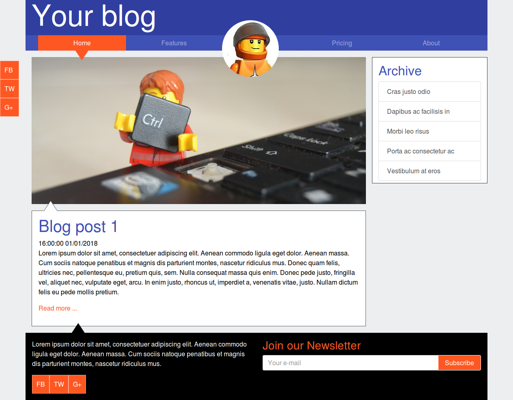

# Bootstrap 4 Weblog

Bootstrap 4 [Bootstrap 4](http://v4-alpha.getbootstrap.com/) Weblog Project. It includes a Sass compiler and a set of Panini HTML templates for you. [Panini](https://github.com/zurb/panini) is a super simple flat file generator for use with Gulp. It compiles a series of HTML pages using a common layout. These pages can also include HTML partials, external Handlebars helpers, or external data as JSON or YAML.

## Example



## Installation

To use this template, your computer needs:

- [NodeJS](https://nodejs.org/en/) (0.12 or greater)
- [Git](https://git-scm.com/)

This template can be installed with the Bootstrap CLI, or downloaded and set up manually.

### Using the CLI

Install the Bootstrap CLI with this command:

```bash
[sudo] npm install -g gulp bower
npm install bootstrap-cli --global
```

Use this command to set up an empty Bootstrap 4 project:

```bash
bootstrap new --repo https://github.com/bassjobsen/bootstrap-weblog.git
```

The CLI will prompt you to give your project a name. The code will be downloaded into a folder with this name.

### Manual Setup

To manually set up the project, first download it with Git:

```bash
git clone https://github.com/bassjobsen/bootstrap-weblog projectname
```

Then open the folder in your command line, and install the needed dependencies:

```bash
cd projectname
npm install
bower install
```

Finally, run `npm start` to run the Sass and HTML template compiler. They will re-run every time you save a Sass or HTML template file.

